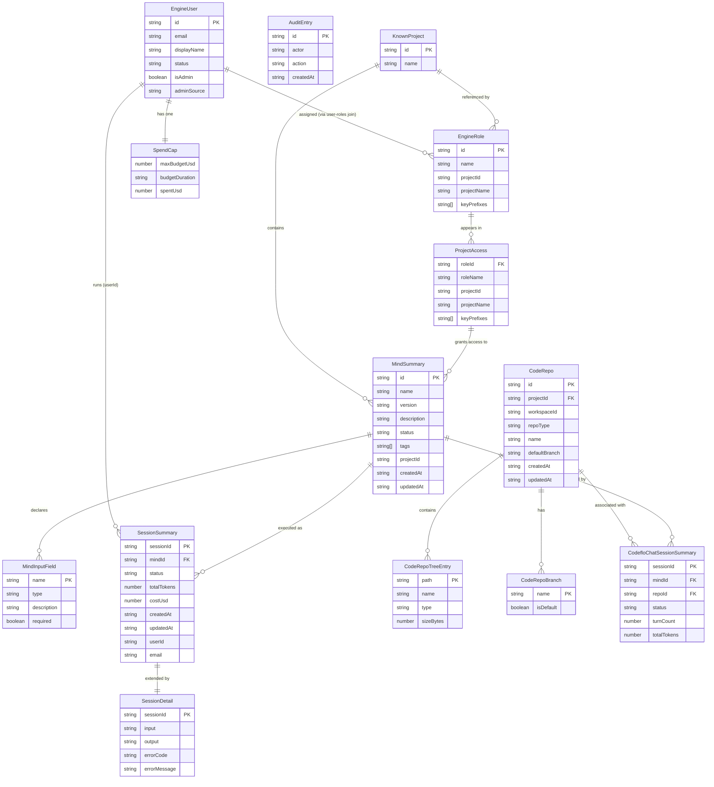

# Data Model Analysis

**Project**: ai-studio-enterprise
**Analysis Date**: 2026-09-17

This application has no local database. It is a React SPA that consumes a remote edge engine REST API. All persistence lives in the edge engine's backend. The data models documented here are the TypeScript interface definitions used to type-check API responses. They faithfully represent the edge engine's wire contract.

Sources:
- `src/types/engine.ts` (all engine API models)
- `src/types/codeRepos.ts` (code repository models)
- `src/lib/engineClient.ts` (inline interfaces)

---

## Entity 1: WhoAmI

**File**: `src/types/engine.ts` lines 5-13
**Purpose**: Current signed-in identity returned by `GET /user/whoami`.

| Field        | Type                           | Description                                  |
|--------------|--------------------------------|----------------------------------------------|
| `uid`        | string                         | User unique ID                               |
| `eml`        | string                         | Email address                                |
| `sid`        | string                         | Session ID                                   |
| `roles`      | string[]                       | Assigned role IDs                            |
| `isAdmin`    | boolean                        | System admin flag                            |
| `adminSource`| "env" \| "granted" \| null (optional) | How admin was granted (env allowlist or explicit grant) |

**Constraints**: No PK/FK (API response, not persisted locally). `isAdmin` required; `adminSource` optional.

---

## Entity 2: EngineUser

**File**: `src/types/engine.ts` lines 15-23
**Purpose**: A user account as known to the edge engine; returned by admin user list/detail APIs.

| Field        | Type                           | Description                                   |
|--------------|--------------------------------|-----------------------------------------------|
| `id`         | string                         | Primary key (engine-assigned UUID)            |
| `email`      | string                         | Email address; unique per user                |
| `displayName`| string                         | Human-readable name                           |
| `status`     | string                         | "active" or "disabled" (soft-delete)          |
| `isAdmin`    | boolean                        | System admin flag                             |
| `adminSource`| "env" \| "granted" \| null (optional) | Admin grant source                  |

**Constraints**: `id` is PK. `email` must be unique. `status` is effectively an enum ("active"/"disabled").

---

## Entity 3: EngineRole

**File**: `src/types/engine.ts` lines 25-47
**Purpose**: A Role — maps a name to a project and its API key prefixes. Controls which Minds a user can access.

| Field        | Type                                         | Description                                            |
|--------------|----------------------------------------------|--------------------------------------------------------|
| `id`         | string                                       | Primary key (engine-assigned UUID)                     |
| `name`       | string                                       | Human label for the role (e.g., "developer")           |
| `projectId`  | string (optional)                            | AI Studio project UUID; absent on "bare" Roles         |
| `projectName`| string (optional)                            | Cached project label; may be absent                    |
| `keyPrefixes`| string[] (optional)                          | API key prefix strings (first 12+ chars of key)        |
| `keys`       | Array of {prefix, name?, hasStoredKey} (optional) | Richer key info with stored-raw-key flag          |

**Constraints**: `id` is PK. `projectId` is nullable (schema v36+). A "bare" Role has no `projectId` and grants nothing to users. `hasStoredKey` determines whether users with this Role can execute Minds without pasting a key.

---

## Entity 4: AuditEntry

**File**: `src/types/engine.ts` lines 49-55
**Purpose**: An immutable audit log record of an admin action.

| Field       | Type                    | Description                          |
|-------------|-------------------------|--------------------------------------|
| `id`        | string                  | Primary key                          |
| `actor`     | string                  | Who performed the action (email/uid) |
| `action`    | string                  | Action name (e.g., "create_user")    |
| `detail`    | Record<string, unknown> | Action-specific metadata (JSON)      |
| `createdAt` | string                  | ISO 8601 timestamp                   |

**Constraints**: `id` is PK. Append-only (no updates/deletes). `createdAt` required.

---

## Entity 5: MindInputConstraints

**File**: `src/types/engine.ts` lines 66-75
**Purpose**: Validation rules for a Mind's input field.

| Field                | Type               | Description                                     |
|----------------------|--------------------|-------------------------------------------------|
| `max_size_bytes`     | number (optional)  | Maximum file size in bytes                      |
| `max_length`         | number (optional)  | Maximum character length                        |
| `pattern`            | string (optional)  | Regex pattern for string validation             |
| `allowed_mime_types` | string[] (optional)| Allowed MIME types for file inputs              |
| `max_files`          | number (optional)  | Maximum file count                              |
| `max_total_size_bytes`| number (optional) | Maximum total size for multi-file uploads       |
| `allow_multiple`     | boolean (optional) | Whether multiple values allowed                 |

---

## Entity 6: MindInputField

**File**: `src/types/engine.ts` lines 83-91
**Purpose**: One declared input field on a Mind's interface — used to build the execution form.

| Field         | Type                      | Description                               |
|---------------|---------------------------|-------------------------------------------|
| `name`        | string                    | Input field identifier                    |
| `type`        | string                    | Field type ("text", "file", etc.)         |
| `description` | string                    | Human-readable description                |
| `required`    | boolean                   | Whether the field is mandatory            |
| `constraints` | MindInputConstraints (opt)| Validation rules                          |
| `schema`      | MindInputSchema (optional)| JSON Schema fragment (enum/oneOf)         |

---

## Entity 7: MindSummary

**File**: `src/types/engine.ts` lines 98-109
**Purpose**: A published AI Mind (workflow/agent) accessible to the user.

| Field       | Type               | Description                                         |
|-------------|--------------------|-----------------------------------------------------|
| `id`        | string             | Primary key (Mind UUID)                             |
| `name`      | string             | Display name                                        |
| `version`   | string             | Version string                                      |
| `description`| string            | Human-readable description                          |
| `status`    | string             | Publication status ("published", "draft", etc.)     |
| `tags`      | string[]           | Categorization tags (used for type badge logic)     |
| `createdAt` | string             | ISO 8601 creation timestamp                         |
| `updatedAt` | string             | ISO 8601 update timestamp                           |
| `projectId` | string (optional)  | Project; present only in admin browse-as-user path  |
| `inputs`    | MindInputField[]   | Declared input fields                               |

**Constraints**: `id` is PK. `tags` drives UI badge display logic.

---

## Entity 8: SessionSummary

**File**: `src/types/engine.ts` lines 115-125
**Purpose**: A past execution run (summary) from the session history.

| Field        | Type               | Description                                      |
|--------------|--------------------|--------------------------------------------------|
| `sessionId`  | string             | Primary key                                      |
| `mindId`     | string             | FK to MindSummary.id                             |
| `status`     | string             | Run status ("completed", "failed", "cancelled")  |
| `totalTokens`| number             | Total token count for the run                    |
| `costUsd`    | number \| null     | Monetary cost; null if not tracked               |
| `createdAt`  | string \| null     | ISO 8601 start timestamp                         |
| `updatedAt`  | string \| null     | ISO 8601 last update timestamp                   |
| `userId`     | string (optional)  | Present on admin fleet-wide endpoint only        |
| `email`      | string (optional)  | Present on admin fleet-wide endpoint only        |

**Constraints**: `sessionId` is PK. `mindId` is FK (not enforced client-side). `costUsd: null` means not tracked, not zero.

---

## Entity 9: SessionDetail

**File**: `src/types/engine.ts` lines 131-137
**Purpose**: Full execution record including input/output payloads. Extends SessionSummary.

| Field          | Type            | Description                              |
|----------------|-----------------|------------------------------------------|
| (all from SessionSummary) | -  | Inherited fields                         |
| `input`        | unknown         | Exact input payload passed to the Mind   |
| `output`       | unknown         | Mind output; structure varies per Mind   |
| `errorCode`    | string \| null  | Machine-readable error code if failed    |
| `errorMessage` | string \| null  | Human-readable error message if failed   |

---

## Entity 10: ProjectAccess

**File**: `src/types/engine.ts` lines 148-156
**Purpose**: One Role the signed-in user holds — includes the project, key prefixes, and Minds accessible.

| Field        | Type               | Description                                       |
|--------------|--------------------|---------------------------------------------------|
| `roleId`     | string             | FK to EngineRole.id                               |
| `roleName`   | string             | Role name                                         |
| `projectId`  | string             | AI Studio project UUID                            |
| `projectName`| string \| null     | Cached project label; null if not yet known       |
| `keyPrefixes`| string[]           | API key prefixes this Role grants                 |
| `keyNames`   | (string \| null)[] | Friendly labels, index-aligned with keyPrefixes   |
| `minds`      | MindSummary[]      | Published Minds accessible via this Role          |

---

## Entity 11: SpendCap

**File**: `src/types/engine.ts` lines 174-178
**Purpose**: A user's LiteLLM budget cap and current spend.

| Field            | Type               | Description                                         |
|------------------|--------------------|-----------------------------------------------------|
| `maxBudgetUsd`   | number \| null     | Cap in USD; null = uncapped (not the same as $0.00) |
| `budgetDuration` | string \| null     | Reset window (e.g., "30d"); required when cap set   |
| `spentUsd`       | number \| null (optional) | Current spend; null = unknown (LiteLLM unreachable) |

**Constraints**: `maxBudgetUsd: null` vs `0` is semantically distinct. Non-null cap requires non-null `budgetDuration`.

---

## Entity 12: TopupRequestResult

**File**: `src/types/engine.ts` lines 183-186
**Purpose**: Response when employee requests a spend cap increase.

| Field       | Type   | Description                |
|-------------|--------|----------------------------|
| `requestId` | string | Request primary key        |
| `status`    | string | Request status (pending etc.)|

---

## Entity 13: CodeRepo

**File**: `src/types/codeRepos.ts` lines 3-21
**Purpose**: A connected code repository (internal GitLab, GitHub, Bitbucket, etc.).

| Field                   | Type                   | Description                                 |
|-------------------------|------------------------|---------------------------------------------|
| `id`                    | string                 | Primary key (UUID)                          |
| `projectId`             | string                 | Owning AI Studio project UUID               |
| `workspaceId`           | string                 | Workspace UUID                              |
| `repoType`              | CodeRepoType           | "internal_gitlab", "private_gitlab", "github", "bitbucket" |
| `name`                  | string                 | Display name                                |
| `description`           | string \| null         | Optional description                        |
| `defaultBranch`         | string \| null         | Default branch name                         |
| `gitlabProjectId`       | number \| null (opt)   | GitLab project numeric ID                   |
| `gitlabUrl`             | string \| null (opt)   | GitLab instance URL                         |
| `githubRepoFullName`    | string \| null (opt)   | "owner/repo" format                         |
| `bitbucketRepoFullName` | string \| null (opt)   | Bitbucket repo full name                    |
| `bitbucketEmail`        | string \| null (opt)   | Bitbucket account email                     |
| `edgeConnectorRef`      | string \| null (opt)   | Edge cluster VCS connector reference        |
| `clonePath`             | string \| null (opt)   | Local clone path on edge cluster            |
| `workingDirectory`      | string \| null (opt)   | Working directory within clone              |
| `createdAt`             | string (optional)      | ISO 8601 creation timestamp                 |
| `updatedAt`             | string (optional)      | ISO 8601 update timestamp                   |

**Constraints**: `id` is PK. `projectId`, `workspaceId` are FK to engine entities. VCS-specific fields are mutually exclusive depending on `repoType`.

---

## Entity 14: CodeRepoTreeEntry

**File**: `src/types/codeRepos.ts` lines 27-32
**Purpose**: One entry in a repository's file tree.

| Field       | Type                   | Description                    |
|-------------|------------------------|--------------------------------|
| `name`      | string                 | File or directory name         |
| `path`      | string                 | Full path from repo root       |
| `type`      | "dir" \| "file"        | Entry type                     |
| `sizeBytes` | number \| null (opt)   | File size in bytes             |

---

## Entity 15: CodeRepoBranch

**File**: `src/types/codeRepos.ts` lines 43-46
**Purpose**: One branch in a repository.

| Field       | Type    | Description                   |
|-------------|---------|-------------------------------|
| `name`      | string  | Branch name                   |
| `isDefault` | boolean | Whether this is the default   |

---

## Entity 16: CodeRepoFileResponse

**File**: `src/types/codeRepos.ts` lines 48-55
**Purpose**: A single file's content from the repository.

| Field      | Type                            | Description                             |
|------------|---------------------------------|-----------------------------------------|
| `source`   | "workspace" \| "git" \| "vcs"   | Where the file was read from            |
| `path`     | string                          | File path                               |
| `encoding` | "utf8" \| "base64" (optional)   | Content encoding                        |
| `content`  | string (optional)               | File content (may be absent if too large)|
| `sizeBytes`| number (optional)               | File size                               |
| `tooLarge` | boolean (optional)              | True when file exceeds size limit       |

---

## Entity 17: CodefloChatSessionSummary

**File**: `src/lib/engineClient.ts` lines 600-611
**Purpose**: A CodeFlo chat conversation (one row per chat thread).

| Field        | Type               | Description                            |
|--------------|--------------------|----------------------------------------|
| `sessionId`  | string             | Primary key                            |
| `mindId`     | string \| null     | Associated Mind ID                     |
| `repoId`     | string \| null     | Associated code repo ID                |
| `title`      | string \| null     | Auto-generated or user title           |
| `summary`    | string \| null     | Chat summary                           |
| `status`     | string             | Session status                         |
| `turnCount`  | number             | Number of chat turns                   |
| `totalTokens`| number             | Total tokens used                      |
| `createdAt`  | string \| null     | ISO 8601 creation time                 |
| `updatedAt`  | string \| null     | ISO 8601 last update time              |

---

## Entity 18: KnownProject

**File**: `src/lib/engineClient.ts` lines 512-513
**Purpose**: A known AI Studio project (for Role mapping UI).

| Field  | Type           | Description                                 |
|--------|----------------|---------------------------------------------|
| `id`   | string         | Project UUID (PK)                           |
| `name` | string \| null | Cached project name; null if not yet set    |

---

## Entity Relationship Diagram

