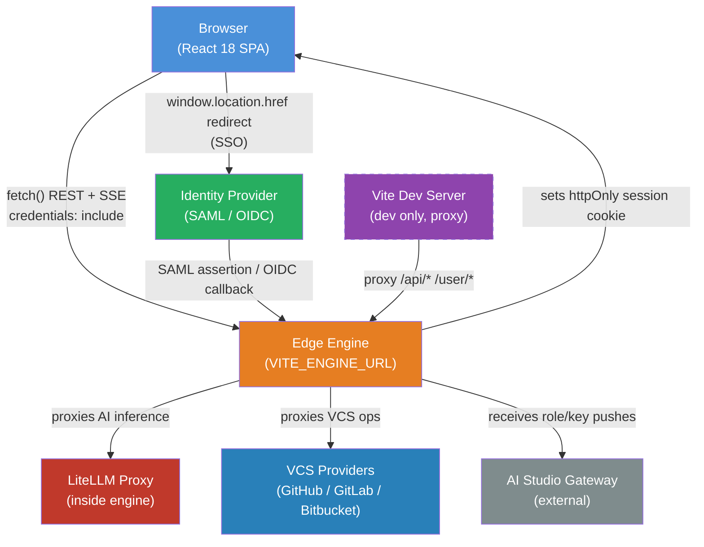
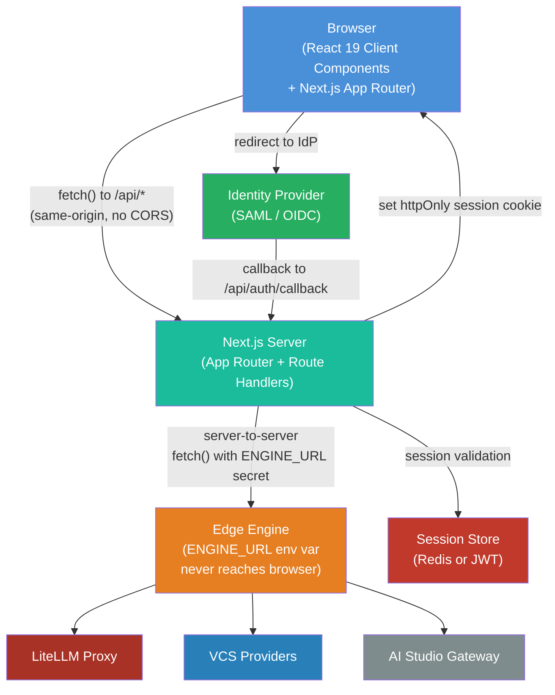

# High-Level Design (HLD)

**Project**: ai-studio-enterprise (TP-Web Edge Client)
**Version**: 1.0
**Date**: 2026-09-17

---

## 1. Current Architecture

The existing system is a React 18 SPA deployed as a static bundle. All API calls are made from the browser directly to the edge engine.



### Current Architecture Components

| Component          | Technology               | Role                                                   |
|--------------------|--------------------------|--------------------------------------------------------|
| Browser App        | React 18 + Vite 6 SPA   | UI, routing, state, direct API calls from browser      |
| `engineClient.ts`  | TypeScript module        | Single gateway — all `fetch()` calls                   |
| TanStack Query     | v5 (in-browser)          | Cache layer for API responses                          |
| React Router v6    | In-browser router        | Client-side page routing                               |
| Edge Engine        | FastAPI (external)       | REST API, SSO, LiteLLM proxy, VCS, Mind execution      |
| sessionStorage     | Browser                  | Admin key storage (session-scoped)                     |
| localStorage       | Browser                  | Theme, Mind Share Key (for admins), sidebar state      |

### Current Architecture Limitations

1. `VITE_ENGINE_URL` is baked into the JavaScript bundle (visible in browser).
2. No server-side rendering; blank page on slow connections until JS loads.
3. No build-time API response validation.
4. All auth logic lives entirely in client-side React state.
5. No automated tests in the repository.

---

## 2. Target Architecture

The target system migrates to a Next.js 15 (App Router) architecture. API calls to the edge engine move from the browser to Next.js Route Handlers on the server, eliminating credential exposure in the bundle.



### Target Architecture Components

| Component           | Technology                          | Role                                               |
|---------------------|-------------------------------------|----------------------------------------------------|
| Next.js App Shell   | Next.js 15, React 19, TypeScript 5.5| SSR/RSC routing, layout, streaming UI              |
| Route Handlers      | Next.js `/app/api/**`               | Proxy all engine calls; `ENGINE_URL` stays server-side |
| TanStack Query      | v5 (client components)              | Client-side data caching and mutation management   |
| next-auth or custom | Next.js middleware                  | Session cookie management, auth guards             |
| Tailwind CSS 4.x    | PostCSS                             | Styling (utility-first, unchanged)                 |
| Edge Engine         | FastAPI (unchanged)                 | Same API, no changes required                      |
| Redis (optional)    | Upstash / self-hosted               | Server-side session validation (optional enhancement)|

### Target Architecture Benefits

1. `ENGINE_URL` and admin credentials stored server-side only (ENV vars, never bundled).
2. Streaming responses (SSE) proxied through Next.js Route Handlers without exposing engine host.
3. React Server Components reduce bundle size for static admin pages.
4. Standardised session handling via Next.js middleware.
5. Built-in image and font optimization.

---

## 3. Data Flow Comparison

### Current (Browser calls engine directly)
```
User action -> React event -> engineClient.ts -> fetch(ENGINE_URL/...) -> Engine
```

### Target (Browser calls Next.js; Next.js calls engine)
```
User action -> React client component -> fetch(/api/...) -> Next.js Route Handler -> fetch(ENGINE_URL/...) -> Engine
```

SSE streaming path:
```
User sends -> Next Route Handler -> engine SSE stream -> ReadableStream proxy -> browser EventSource/fetch
```

---

## 4. Module Boundaries (Target)

```
app/
|-- (auth)/
|   |-- login/         <- SSO/password login pages (RSC + client forms)
|   `-- api/auth/      <- Auth route handlers (callback, sign-out)
|-- (app)/
|   |-- layout.tsx     <- AppLayout with sidebar/topbar (RSC)
|   |-- dashboard/     <- Workbench page (RSC data prefetch)
|   |-- run/           <- Run Minds page (client component — SSE streaming)
|   |-- code-repos/    <- CodeFlo+ pages
|   |-- docflo/        <- DocFlo+ pages
|   `-- (admin)/       <- Admin-only route group
|       |-- users/
|       |-- roles/
|       |-- credits/
|       `-- audit/
`-- api/               <- Route Handlers (server-side engine proxy)
    |-- engine/        <- Transparent proxy middleware
    |-- auth/          <- Auth endpoints
    `-- stream/        <- SSE stream proxy
```

---

## 5. Key Design Decisions

| Decision                    | Current          | Target           | Rationale                                    |
|-----------------------------|------------------|------------------|----------------------------------------------|
| API call origin             | Browser (client) | Server (Next.js) | Keep engine URL + credentials off client     |
| Routing                     | React Router v6  | Next.js App Router| Aligned with ecosystem; RSC support          |
| Auth session                | Cookie (httpOnly from engine) | Next.js middleware + engine cookie | Consistent session across RSC and client components |
| Build tool                  | Vite             | Next.js/Turbopack| Native RSC support; integrated dev/prod pipeline |
| Theme storage               | localStorage     | localStorage (preserved) | No server context needed for theme |
